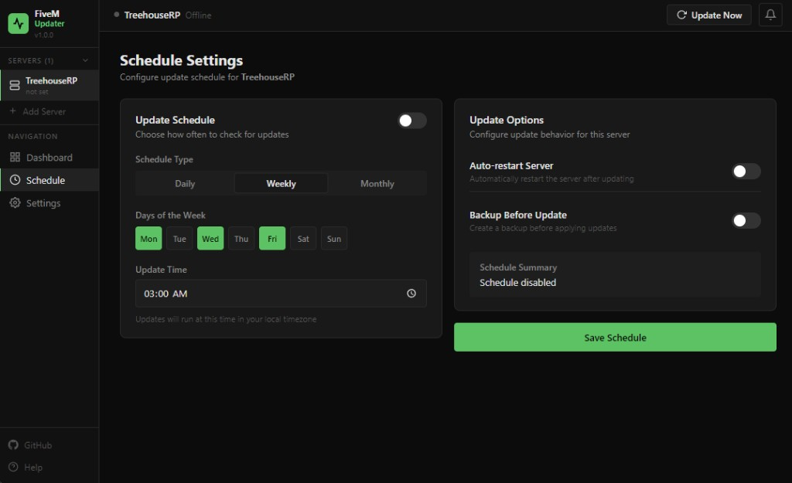

# FiveSync 🕒🔁

<div align="center">
  
</div>

<div align="center">
  
</div>

FiveSync is a desktop Electron app that keeps your FiveM server artifacts up to date automatically. ✨

Add multiple servers, detect newer builds from `runtime.fivem.net`, and apply updates on demand or on a schedule, with progress, history, and rollback. ✅

## Features 🚀

- Multi-server management (add/edit/delete) 🧰
- Detect “latest available” builds from the FiveM runtime feed 📡
- Update scheduling (daily/weekly/monthly) with per-server toggles 🗓️
- Pinned builds + rollback from update history ↩️
- Configurable connector authentication (bearer/basic/custom header) 🔐
- Update status, logs/progress, and toast notifications 📣
- Auto-update for the FiveSync app itself (via `electron-updater`) 🔄

## Requirements ⚙️

- Node.js (20+ recommended)
- Windows (app targets NSIS installer)

## Quick Start (Development) 🧪

```bash
npm install
npm run dev
```

## Build 🏗️

```bash
npm run build
```

## Package for Release 📦

```bash
npm run dist
```

## Notes / Implementation Details 📝

- Server data is stored in Electron’s `userData` as a pure JSON file (no native DB dependency) 📁
- Sync downloads artifacts to a per-server cache directory under `userData/cache/<serverId>/` 💾

## Support

If you want, tell me what you’d like to improve next (installer branding, log viewer details, or actual file install/backup behavior after download). 🙌

